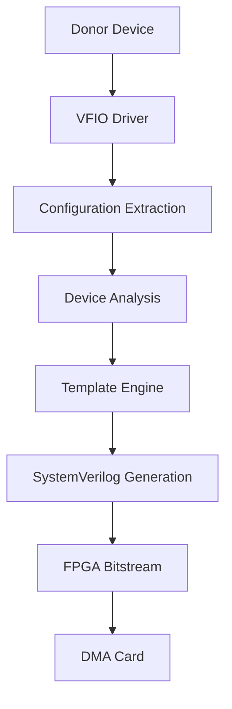

# PCILeech Firmware Generator

[](https://github.com/ramseymcgrath/PCILeechFWGenerator/actions/workflows/ci.yml)
[](https://codecov.io/gh/ramseymcgrath/PCILeechFWGenerator)
[](https://github.com/ramseymcgrath/PCILeechFWGenerator)
[](LICENSE.txt)

!!! info "About PCILeech Firmware Generator"
    Generate authentic PCIe DMA firmware from real donor hardware with a single command. This tool extracts donor configurations from a local device and generates unique PCILeech FPGA bitstreams (and optionally flashes a DMA card over USB-JTAG).

## 🚀 Quick Start

```bash
# Install the package
pip install pcileech-fw-generator

# Generate firmware from a donor device
pcileech-generate --device 0000:01:00.0 --board pcileech_100t484_x1

# Flash to FPGA (optional)
pcileech-generate --device 0000:01:00.0 --board pcileech_100t484_x1 --flash
```

## ✨ Key Features

### 🎯 Authentic Device Cloning
- **Real Hardware Extraction**: Extract configuration from actual PCIe devices
- **VFIO Integration**: Direct access to device configuration space
- **Complete Device Profiles**: Capture all device characteristics and capabilities

### 🔧 Advanced Firmware Generation
- **SystemVerilog Templates**: Professional-grade FPGA design generation
- **Configuration Space Shadow**: Full 4KB config space in BRAM
- **Dynamic Capabilities**: Automatic detection and implementation of PCIe capabilities
- **Overlay RAM**: Writable register field handling

### 🎛️ User-Friendly Interface
- **Interactive TUI**: Beautiful terminal user interface
- **CLI Integration**: Full command-line support for automation
- **Progress Tracking**: Real-time generation progress
- **Error Handling**: Comprehensive error reporting and recovery

### 🏗️ Professional Build System
- **Vivado Integration**: Automatic TCL script generation
- **Template Engine**: Flexible Jinja2-based template system
- **Build Automation**: Complete project setup and configuration
- **Quality Assurance**: Comprehensive testing and validation

## 🎯 Use Cases

### 🔬 Security Research
- Penetration testing and red team operations
- Hardware security assessment
- DMA attack research and defense

### 🎓 Educational
- PCIe protocol learning and experimentation
- FPGA development education
- Hardware security training

### 🧪 Development
- PCIe device driver development
- Hardware debugging and analysis
- Custom DMA solution prototyping

## 🏛️ Architecture Overview

The PCILeech Firmware Generator uses a sophisticated multi-layer architecture:



### Core Components

- **[Configuration Space Manager](config-space-shadow.md)**: Handles PCIe config space extraction and emulation
- **[Template Architecture](template-architecture.md)**: Flexible template system for firmware generation
- **[Device Capabilities](dynamic-device-capabilities.md)**: Dynamic PCIe capability detection and implementation
- **[Build System](development.md)**: Automated FPGA project generation and building

## 📋 Requirements

### System Requirements
- **Operating System**: Linux (Ubuntu 20.04+ recommended)
- **Python**: 3.8 or higher
- **Memory**: 4GB RAM minimum, 8GB recommended
- **Storage**: 2GB free space for FPGA tools

### Hardware Requirements
- **FPGA Board**: Supported Xilinx development board
- **Donor Device**: PCIe device for configuration extraction
- **USB-JTAG**: For optional FPGA programming

### Software Dependencies
- **Xilinx Vivado**: 2020.1 or later (for FPGA synthesis)
- **VFIO Drivers**: For donor device access
- **Git**: For repository management

## 🎯 Supported Devices

The generator supports a wide range of PCIe devices:

- **Network Cards**: Intel, Broadcom, Mellanox
- **Storage Controllers**: NVMe, SATA, SAS
- **Graphics Cards**: NVIDIA, AMD (basic support)
- **Custom Hardware**: Any standard PCIe device

For a complete list, see [Supported Devices](supported-devices.md).

## 🛡️ Security Considerations

!!! warning "Responsible Use"
    This tool is designed for legitimate security research, education, and development purposes. Users are responsible for ensuring compliance with applicable laws and regulations.

### Best Practices
- Only use on systems you own or have explicit permission to test
- Follow responsible disclosure for any vulnerabilities discovered
- Respect intellectual property and licensing requirements
- Use appropriate safety measures when working with hardware

## 🤝 Community

- **GitHub**: [Issues and Pull Requests](https://github.com/ramseymcgrath/PCILeechFWGenerator)
- **Discord**: Join our community server
- **Documentation**: Comprehensive guides and tutorials

## 📄 License

This project is licensed under the MIT License - see the [LICENSE](https://github.com/ramseymcgrath/PCILeechFWGenerator/blob/main/LICENSE.txt) file for details.

---

**Ready to get started?** Check out our [Installation Guide](installation.md) or dive into the [Quick Start](quick-start.md) tutorial!
